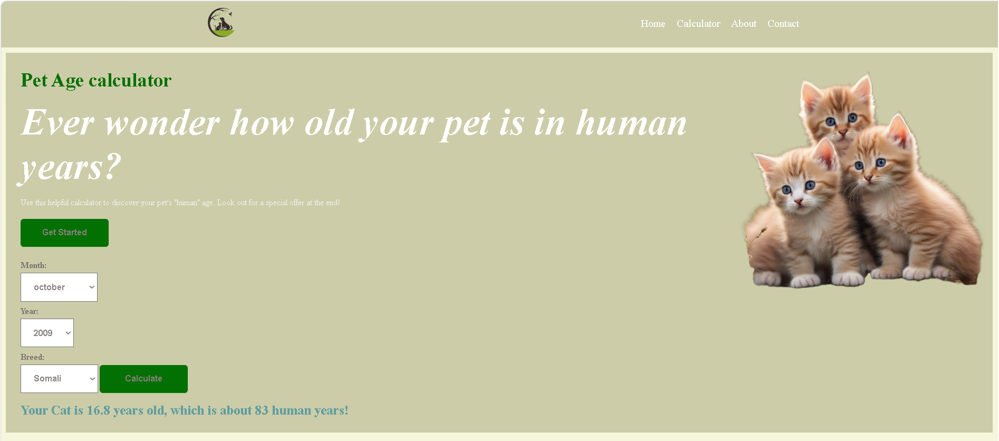

SI ROOTS Pet Age Calculator

A Pedigree-inspired calculator that converts a pet's age into human years, factoring in birth date and breed size.

**[Live Demo](https://ikhansa623-source.github.io/Pet-Age-Calculator/)**



SI ROOTS Overview

Users select their pet's birth month and year, pick a breed from a dropdown, and get an estimated "human age" equivalent — using an age formula that adjusts based on breed size (small, medium, large).

SI ROOTS Features

- 📅 Real date-based age calculation (not just a manual number input)
- 🐕 Breed-to-size lookup table for more accurate results
- 📊 Human-year conversion using a tiered growth formula
- 📱 Responsive layout for mobile and desktop
- 🎨 Clean, form-driven UI inspired by Pedigree's own calculator

SI ROOTS Tech Stack

- **HTML5** — form structure
- **CSS3** — responsive design, custom form styling
- **JavaScript (ES6+)** — `Date` object for age calculation, dynamic dropdown population, conditional logic for the age formula

SI ROOTS What I Learned Building This

This project introduced working with JavaScript's `Date` object for real calendar math, and taught the difference between a flat age-multiplier and a tiered formula (the first two years of a pet's life don't age the same way later years do). It also reinforced building maintainable lookup data (the breed-to-size object) instead of hardcoding conditions.

SI ROOTS Running Locally

1. Clone this repository
2. Open `index.html` in any browser — no server or build step required

SI ROOTS Folder Structure

```
├── index.html
├── script.js
├── style.css
├── screenshot/              ← naya folder
│   └── hero-sec.png
└── favicon.png
```


Built by [khansa iqbal] — [SI ROOTS](https://ikhansa623-source.github.io/Iqbal-s-Roots-portfolio-/)